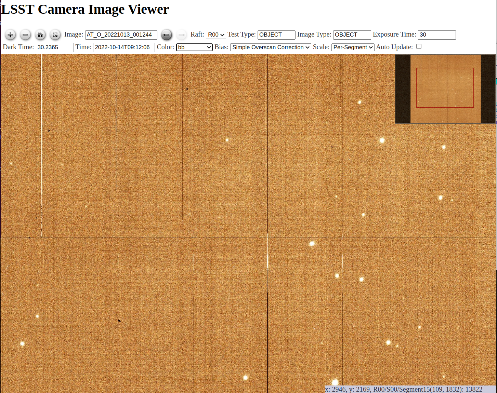
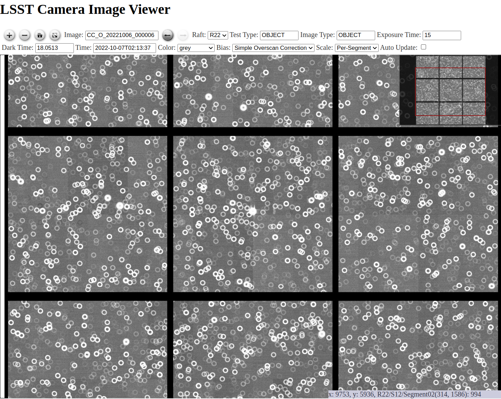
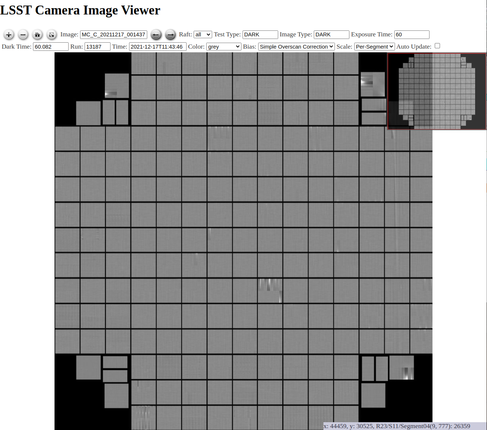

:tocdepth: 2

.. sectnum::

.. Metadata such as the title, authors, and description are set in metadata.yaml

.. _SITCOM-173: https://jira.lsstcorp.org/browse/SITCOM-173
.. _SITCOM-174: https://jira.lsstcorp.org/browse/SITCOM-174
.. _SITCOM-180: https://jira.lsstcorp.org/browse/SITCOM-180
.. _LSE-72: https://ls.st/LSE-72
.. _Prompt Processing: https://dmtn-219.lsst.io/
.. _charge: https://sitcomtn-030.lsst.io/
.. _FAFF report: https://sitcomtn-025.lsst.io/
.. _Sasquatch: https://sqr-068.lsst.io/

Abstract
========

The second `charge`_ to the First-Look Analysis and Feedback Functionality Breakout Group details questions regarding the displays and functionalities required to perform continuous nightly commissioning activities.
The focus is on defining the required functionalities to perform inspection and analyses within approximately 24-hours of taking the data.
This document details the answers to the charge questions and other findings.

Executive Summary
=================

The second First-Look Analysis and Feedback Functionality (FAFF2) report details the computational tasks and interactions with resultant data products that are needed to support the full 24-hour cycle of sustained observatory operations.
Starting from a set of use-cases derived from expected commissioning needs and experience with other observatories, we identified two major compute-intensive tasks that are required for near-realtime evaluation of data quality to support nighttime decision making:

- A **Rapid Analysis** capability is needed to run single-frame processing (SFP) through the source detection and measurement steps on bright stars in order to make basic measurements of delivered image quality and optical throughput.
- A **Camera Visualization Tool** is needed to rapidly display full focal plane images, including those accessible via the Butler, and zoom in to inspect pixel-level details.

We recommend that compute resources to support both of these tasks be located on the summit so that observers have near-realtime data quality information even in the event of a network outage.
Basic camera health diagnostics and the aforementioned image display capabilities will run on the Camera Diagnostic Cluster, already located at the summit.
Rapid analysis would run on the commissioning cluster (Antu) that is currently in the process of having its hardware relocated to the summit.
Making these capabilities available for use at the summit, especially Rapid Analysis, is the highest priority recommendation of the FAFF2 report.

Once the above computing resources are available at the summit, the next priorities are:

- Deploy the Rapid Analysis framework
- Begin calculating and logging low-level camera health diagnostics using the Camera Diagnostic Cluster
- Stand up databases to record the time series of telemetry together with metric values produced by Rapid Analysis and camera health diagnostics (e.g., the Visit database and Sasquatch)
- Develop the framework for generating notifications and/or alarms that metric values and reduced images are available.

With this infrastructure in place, we will begin using the tools together to generate, record, alert, display, and ultimately react to non-compliant metric values.
From this stage, we will expand capabilities to produce a variety of displays via multiple tools, including; metric time series and corresponding telemetry data (Chronograf), scalar fields (Bokeh apps), full focal plane image visualization (Camera Visualization Tool), as well as generate alarms and more detailed reports (Catcher).
Emphasis should initially be on exercising the interfaces between these tools and then expanding the capabilities of individual tools.

The creation of a unified toolset to perform both data-driven and control-system driven tasks requires accumulating data from multiple components and databases.
:numref:`fig_data_flow` shows the data flows from the different data sources, and demonstrates which data is available from each of the user-facing tools.
Although not explicitly shown in the diagram, this data and tool set shall be made available at USDF (with the exception of LOVE and the summit-alert system, as they are directly connected to the summit control network).

.. _fig_data_flow:

.. figure:: _static/FAFF2\ data\ flow\ diagram.png

   : Data flow from sources, to databases, to user-facing tools.
   The details of each component, their uses, and available data are discussed in detail throughout the report.

The user-facing tools satisfy multiple use-cases, satisfying the required functionalities for both data-driven and observatory control driven tasks.
However, a common landing page containing explanations of which tools are best-suited for particular applications is required.
This could be achieved by adding content to the `Science Platform landing page <https://data.lsst.cloud/>`_, which is already performing a similar purpose.
This requires augmenting the functionality of certain tools such that they are capable of supporting linking and callbacks between themselves, such that the user smoothly moves between the interfaces.
Although demonstrated to be feasible by this working group, additional effort is required to properly integrate the components.
:numref:`fig_venn_diagram` shows the envisioned set of tools, and which are used for each aspect of data interaction.
The solid lines between the components indicate which tools can interface with others.

.. _fig_venn_diagram:
.. figure:: _static/FAFF2\ venn\ diagram.png

   : Data-driven users and control-system users both share a common set of tools to perform their tasks.
   With a modest amount of effort, these tools can be better integrated to provide a smooth and unified user-experience.

While drafting the FAFF report, we explored several demonstrations of the functionality described above, but implementation of an end-to-end system is beyond the scope of this group.
Many of the tasks above can be pursued in parallel, but draw upon a specific small set of developers, and thus careful coordination and management is needed.
It is recommended that a design-and-implementation group be assembled to develop these tools.
Participants should include personnel from the FAFF working group to maintain continuity and provide additional guidance and/or context to the content in this report.
More individuals will be able to effectively contribute as continued effort is put into developing templates and extensible frameworks.
In addition, we identified several capabilities, such as logging tools and a tabular summary of recent exposures with linked diagnostic information, that would already be in regular use with AuxTel observations but are not currently owned by any person/group.
Most of the planned tooling for visualizing data quality information should be sufficiently straightforward to not require dedicated training for users.

Introduction
============

This report addresses the second `charge`_ to the First-Look Analysis and Feedback Functionality (FAFF) Breakout Group.
The charge was developed based on the findings during the Missing Functionality Workshop that took place February 2nd and 3rd, 2022.
The charge addresses three specific Jira tickets developed from that meeting: `SITCOM-174`_, `SITCOM-173`_, and `SITCOM-180`_.
These are referenced throughout the report.
This working group is focused on what is needed to perform inspection and analyses required within the first 24 hours of taking the data and is not aiming to address all visualization requirements from the `Observatory System Specifications Document <https://ls.st/lse-30>`_.

Much of this report builds off the findings and recommendations of the first `FAFF report`_.
It is expected that the readers are already familiar with these findings and recommendations.

The remainder of this report is structured into sections that address each of the charge questions individually.
The relevant charge question has been copied into each section for ease-of-readability.
The report concludes with a section on findings that are pertinent to the commissioning team but fall outside the scope of the original `charge`_ .
It is recommended that these issues get addressed by either a follow-on charge or another mechanism.

Rapid Analysis Capability
-------------------------

Most of the envisioned FAFF functionality requires data products based on both observatory events and/or telemetry as well as camera images to be available for immediate use at the summit in order to display this information and thereby inform nighttime operations.
While developing use cases, we recorded the applicable input data products and associated timescales for their use, and then compiled these into a consolidated list to better understand the set of required data processing, analysis, artifact creation and handling mechanisms.

We find that multiple FAFF use cases require a `Rapid Analysis <https://confluence.lsstcorp.org/display/LSSTCOM/Rapid+Analysis+Use-Case>`_ capability that includes automated Single Frame Processing (SFP) of camera images through instrument signature removal and source detection on the 30-60 second timescale to enable the creation of various data quality metrics and data visualizations.
The Confluence page linked above describes the needed data products and timescales for their creation, as requested in `charge`_  question 2.
The use cases developed for charge question 1 assume that the data products from this initial processing step are available.

It should be noted that Rapid Analysis appears to share many of the same functionalities as what is often referred to as Prompt Processing.
In writing this report, it was identified that the Prompt Processing terminology is used to refer to slightly different things depending on author and or person, resulting in significant confusion.
In this report, we refer to `Prompt Processing`_ as the *framework* for continuously processing the stream of images coming off the telescope.
This framework is used to execute a `payload <https://pipelines.lsst.io/modules/lsst.ctrl.bps/quickstart.html#defining-a-submission>`_, such as the Science Pipeline payloads for Alert Production including Solar System Processing.
Prompt Processing is to be run at the United States Data Facility (USDF).

The needs for near-realtime data quality assessment by the commissioning team could be partially addressed by a suitable payload executed with the Prompt Processing framework at USDF, provided that results are made available to the summit.
The payload would be the pared-down SFP, augmented with the calculation of metrics and/or values that are pertinent for observatory diagnostics, which then requires a mechanism to report those metrics back into the control system framework such that potential alerts signaling abnormal data can be generated for observers.
Throughout this report, this summit-dedicated data processing is referred to as the "Rapid Analysis payload" or sometimes just "Rapid Analysis," whose instantiation would ensure that on-the-fly diagnostic information is available to observers.
Running the Rapid Analysis payload on the summit, which is shown to be feasible in :ref:`Antu at Summit <antu_at_summit>`, would increase robustness against network outages, and may also provide a faster response depending on the desired reductions.

Responses to Charge Questions and Deliverables
==============================================

The use-cases referenced throughout the document are all found on the `dedicated confluence page <https://confluence.lsstcorp.org/display/LSSTCOM/Use-Cases>`_ and are further described below.

.. _Deliverable 1:

Deliverable 1: Use-Cases
------------------------

.. note::

   The deliverable description from the `charge`_ has been directly copied here to ease readability.

   1. (`SITCOM-174`_, `SITCOM-173`_, `SITCOM-180`_) A series of use-cases where image data analysis is required on short timescales.
      A reduced set of use-cases should be created as a regular reference throughout the charge.
      A set of required turn-around time(s) should be defined and assigned to each case where applicable.

      - Use-cases should be complete, including which inputs are required and from where they will originate (e.g., SAL Script, EFD, LFA, external source), desired manipulations, logic-based operations/calculations, and if/how the desired artifacts are presented to the user (e.g., display images and/or graphs).

Numerous use cases were developed to capture the needed functionalities and assist in developing a common understanding of what is expected in each scenario.
Each of the use cases follow a standardized `template <https://confluence.lsstcorp.org/display/LSSTCOM/On-the-fly+Analysis+Use-Case+Template>`_ which differs slightly from that which was used in the first FAFF charge.

The remaining use-cases for FAFF2 can be found on the FAFF use-cases page `on confluence <https://confluence.lsstcorp.org/display/LSSTCOM/Use-Cases>`_ and are referenced throughout the remainder of this report.

Daytime Calibration
^^^^^^^^^^^^^^^^^^^

During the course of the working group, the example of daytime calibration was raised repeatedly, specifically in regards to how calibration data products are generated and what is expected of the observing specialist.
The aspect pertaining specifically to the FAFF charge is what the observer is required to look at during the process, including both images and/or alarms.
The details of how Daytime Calibration is performed is being documented in `DMTN-222 <https://DMTN-222.lsst.io>`_ and will not be repeated as a new FAFF use-case.

In short, a SAL Script is launched by the observer to acquire a daytime set of calibrations.
This SAL script launches an OCPS-based processing of the images, but the ScriptQueue does not block on the processing awaiting the final analysis.
Currently, if the process fails then no alert is generated automatically.
However, as will be discussed in the following sections, a Watcher (see :ref:`note <note_watcher_csc>`) alarm will be setup to listen and alert users (via LOVE) in the event of a catastrophic failure in the analysis which the observer could do something about (e.g., the shutter did not open and the flats have no signal).
How the observer responds to the alert is currently being discussed.
Presumably, this will use a parameterized notebook that will allow an observer to better understand the issue.
Any viewing of the raw frames themselves will utilize the Camera Visualization Tool.

In the case where a more complex issue arises (e.g., a 2% increase in bad pixels is observed), this is addressed by the calibration team offsite and is not immediately reported to the summit team.
When the calibrations used on the summit need to be updated, this is the role of the calibration scientist and is not the responsibility of the observer.
Furthermore, this cadence is expected to be slow (months) and is therefore outside the scope of this charge.

.. _note_watcher_csc:

.. note::

   The `Watcher CSC <https://ts-watcher.lsst.io/>`_ is provided a list of "rules" that it ensures the system is always obeying.
   If a rule is violated, such as a temperature going out of specification, an alert or alarm is issued to the observer via the LOVE interface.
   The alarm stays in place until the rule is no longer violated and the original alert has been acknowledged.
   The Watcher is not able to perform analyses and only evaluates simple conditions.

.. _Deliverable 2:

Deliverable 2: Rapid Analysis Calculated Metrics
------------------------------------------------

.. note::

   The deliverable description from the `charge`_ has been directly copied here to ease readability.

   2. (`SITCOM-180`_, `SITCOM-173`_) Define which metrics, analyses and artifacts must be calculated and on what timescale they must be evaluated and reported to support commissioning/operations.

      This is to evaluate if a "rapid processing" of data is required, what specific calculations are required.
      This list should include the relevant camera specific calculations (which are currently performed by the EO testing data reduction).
      This is expected to inform the answer to the next charge task.

It is important to note that the charge question above refers to "rapid processing."
We intentionally avoid the use of this term and have adopted the phrasing, "Rapid Analysis" instead.
This is to avoid any potential confusion with Prompt Processing, which is discussed above in the `Rapid Analysis`_ section.

Numerous calculations are required to evaluate both camera and control system health and performance on rapid timescales.
The data products discussed in this section are limited to scalars and/or arrays and do *not* include diagnostic plots and/or figures (visualization use cases are discussed separately).
The majority of data products needed on rapid timescales are produced as part of the Science Pipelines single-frame-processing (SFP) framework.
A small number of additional values are also required, but can be quickly derived from the SFP results.
The values calculated by Rapid Analysis are not fundamental to continuing observations (`FAFF-REQ-0053`_), however, it is expected that observatory functionality will be reduced if an outage were to occur.
This implies that the Rapid Analysis payload is not required to run at the summit, although it would be preferable to do so.
The output from the Rapid Analysis will need to go into a database.
Details of this database are discussed in `Deliverable 3`_.
The output will also have to be made available to the control network such that observers can be alerted if calculated metrics are producing results that exceed the range of nominal values.
The original framework to perform this duty is the Telemetry Interface, described in `LSE-72`_, which is designed to feed metrics from Prompt Processing pipelines running at the USDF back to the summit.
The `LSE-72`_ document is out-of-date, however, either this or an analogous framework is required to perform the same purpose.
`Sasquatch`_ is implementing such functionality, however, it is important that the Watcher CSC can monitor and alert the observer of troubling events.
Under the current architecture, this means that the Watcher must be augmented to analyze EFD data, or the data itself must get passed into the control network such that the Watcher can react to it.
However, if the control system middleware moves from DDS to Kafka, which is currently under review but expected be rolled out early 2023, then the Watcher will gain the ability to monitor the data coming back from USDF and no new functionality will be required.

Based on the committee's experience commissioning previous telescopes, instruments and surveys, three different timescales for data interaction were identified as being critical to successful commissioning, each of which are discussed in the following subsections.
The data products for the rapid timescales (<30 and 60 seconds) are described in the Outputs section of the `Rapid Analysis Use-cases on confluence <https://confluence.lsstcorp.org/display/LSSTCOM/Rapid+Analysis+Use-Case>`_.

<30 seconds
^^^^^^^^^^^
This is the timescale where the data feedback must be made available quickly because it could potentially influence the next activity, configuration, or exposure.
Examples of required functionality at this timescale include displaying of images and evaluation and display of fundamental health metrics.
In the case of performing engineering tasks where corrections or instrument setups are being modified, it is useful to know if the changes impacted the next image as anticipated.
An example of this would be looking at PSF changes as a function of mirror shape or AOS configuration.

The camera commissioning cluster is unique as it is the first significant computing infrastructure to have access to the pixel data.
This is where the Camera Visualization Tool (CVT) is to be run such that users can see the images with the lowest possible latency.
It is also where the camera system conducts low-level measurements to determine camera health, such as median and standard deviation of the overscan regions.
This is then used to help inform the camera health displays, as discussed in the `specific use-case <https://confluence.lsstcorp.org/display/LSSTCOM/Camera+health+check>`_.
Further details regarding use of the commissioning cluster and development of the CVT are discussed in `Deliverable 5`_ and `Deliverable 6`_ respectively.

The Rapid Analysis pipeline is to be run on the Antu servers (the commissioning cluster), where more compute is available and the hardware consists of generic and more easily managed servers.
There are values in the SFP pipeline that are more pertinent to have on shorter timescales, such as the PSF shape.
These values have been identified in the `Rapid Analysis Use-case <https://confluence.lsstcorp.org/display/LSSTCOM/Rapid+Analysis+Use-Case>`_ and if it is possible to output them prior to others it would help increase operational efficiency.

~60 seconds
^^^^^^^^^^^
This timescale is useful when examining trending or slowly varying effects, particularly for metrics like image quality or transparency.
It is a timescale where people are closely watching, but not necessarily immediately reacting.
The addition of this category was to provide flexibility in implementation as it may be such that the prioritization of metrics can be performed which may provide a useful free parameter during the implementation phase.
However, it is imperative that the Rapid Analysis framework be able to keep up with the rate of images being acquired; where that rate is governed by the survey strategy visit duration (`FAFF-REQ-0051`_).
In the case of taking two 15 second snaps, it is expected that the analysis would be done on the combined images.

Again, the data products for the 60 second timescales are described in the Outputs section of the `Rapid Analysis Use-case <https://confluence.lsstcorp.org/display/LSSTCOM/Rapid+Analysis+Use-Case>`_.

12-24 hours
^^^^^^^^^^^
This timescale is important for more general commissioning activities and performance assessment that could impact observations taken in the next or subsequent nights.
Over this timescale, a full SFP pipeline needs to be run (`FAFF-REQ-0052`_).
This must include the additional values that are calculated in the Rapid Analysis Framework, which will need to be added to the SFP pipeline.
Re-calculation of these values enables a more detailed and higher-confidence data quality evaluation to be performed, including correlation with telemetry, environmental conditions, and previous conditions and/or observations.
It also allows the teams to begin determining which subsets of data should be used to construct coadds/templates, begin science verification analyses, and ultimately maximize the number of human brain cycles looking at the data.
It is fully expected that this dataset will be superseded by a subsequent DRP campaign to enforce that all the data is processed in a homogeneous way with best performing configuration of the science pipelines.

It is not required that the 12-24 hour full SFP processing be done in Chile, in fact, it is *preferable* to perform this at the USDF as many of the science verification tasks are planned to be performed there as well.
It also ensures that a minimum number of users are connecting to Chile to perform their analyses.
This is especially important if connections are required to the summit instance.

Lastly, the results of this analysis do not need to be forwarded back to the summit control system.

Potential Paths for Implementation
^^^^^^^^^^^^^^^^^^^^^^^^^^^^^^^^^^

The Rapid Analysis payload relies heavily on single-frame-processing (SFP), and therefore is a compatible payload with both the DRP and the Alert Production Pipelines.
The ultimate implementation decisions are outside the FAFF scope, however, because of the speed requirements, which will necessitate the pre-loading of expected image properties into memory (e.g., catalogues), it is expected that the path of least resistance would be to work with the Alert Production team in the development of Rapid Analysis.

Another aspect which may impact implementation is that Rapid Analysis only needs to run once per frame.
Even upon a failure to produce one of the parameters, or the publishing of an incorrect result, the system will not be rerun and therefore the database containing the results does not need to support versioning or relationships to previous results.

A re-occurring concern has been whether or not the Antu servers can support the Rapid Analysis framework.
FAFF has worked with Rubin project members to create a preliminary analysis of the compute required to run Rapid Analysis and found the following:

.. at with ~250 cores (1 per detector and a handful for overhead), combined with some attention paid to code performance enhancements, we expect that in terms of processing, keeping up with a 30s image cadence is very feasible.

- ~4 cores per CCD are required to perform the data processing
- Using the full 189 CCDs also requires 756 cores which is nearly the entire Antu capability (784 cores)
- To support required data Input/Output (I/O), a cluster would ideally have a small number of cores per node, then spread the data out across multiple disks.
  Antu has a high core-to-node ratio, and is therefore likely unable to run Rapid Analysis for the entire array at a ~30s cadence.

At the moment, it is unclear if the computing infrastructure could be augmented to support full-frame on-the-fly processing in Chile.
If not, then the remaining option is to reduce the number of CCDs that get processed.
DECam encountered the same constraints and invoked a pipeline that supports different configurations that specify various patterns of sensors to reduce.
For example, pointing tests used just the central portion of the focal plane.
It is recommended that Rubin adopt a similar strategy, and a list of possible focal plane configurations should be created.
The Science Verification group has indicated that full focal plane processing is not required in the rapid timescales (<30 and 60 seconds), so long as full frame processing occurs at the USDF within 24-hours.
From the point of view of the AOS group, a checkerboard pattern for the focal plane (omitting the 8 outermost sensors which are highly vignetted), is satisfactory for their analysis requirements.
Note that the camera diagnostic cluster will handle the low-level health checks for *all* sensors, as is discussed in `Deliverable 5`_.

The University of Washington group is now investigating the SFP performance enhancements.
Scaling the experience gained with LATISS, it is expected that a 30s image cadence is feasible and the primary speed limitation will be the I/O constraints.

.. _analysis_tools_overview:

analysis_tools
^^^^^^^^^^^^^^

Several `basic per-detector data quality statistics <https://confluence.lsstcorp.org/display/LSSTCOM/Science+performance+metrics+to+support+nightly+operations>`_ are generated during SFP and persisted in the Butler repository.
These basic quantities can be supplemented by more detailed data quality diagnostics produced by other Science Pipeline components.

The `analysis_tools python package <https://github.com/lsst/analysis_tools>`_ is a refactoring of the faro and analysis_drp packages that provides both metric and plot generation functionality.
The package includes a set of analysis modules that can be run as Tasks within a data reduction pipeline, as part of a separate afterburner pipeline, or imported and executed standalone, in a script/notebook.

The new package more fully leverages DM-middleware capabilities, e.g., high configurability and efficient grouping of analyses into quanta with a smaller number of output files.
Metric values and plots are persisted alongside the input data products in the same Butler repository.
Importantly, analysis_tools adds the ability to easily reconstitute input data products along with the configuration that was used to generate a given metric/plot to enable interactive drill-down analyses.
The package adopts a modular design to encourage re-using code for metric calculation and visualization.
Currently implemented analyses include metrics and plots that run on per-visit source tables, per-tract object tables, per-tract associated sources, and difference image analysis source and object tables.

analysis_tools was added to the main distribution of Science Pipelines (lsst_distrib) in August 2022.
The package now includes multiple example metrics and plots for single-visit, deep coadds, and difference image analysis (DIA) data quality assessment.
For examples, see the `tutorial notebook <https://github.com/lsst-dm/analysis_tools_examples>`_ shown at the Rubin PCW 2022.

.. _Deliverable 3:

Deliverable 3: Interacting with Rapid Analysis Data and Metrics
---------------------------------------------------------------

.. note::

   The deliverable description from the `charge`_ has been directly copied here to ease readability.

   3. (`SITCOM-174`_, `SITCOM-173`_) Define how users will interact with each aspect of the previously listed metrics, analyses and artifacts; classify them indicating where can could calculated.

      This includes tasks defined for the catcher, OCPS jobs, AuxTel/ComCam/LSSTCam processing, and the rendez-vous of data from multiple sources (DIMM, all-sky etc).

This section considers the case of scalar fields, where the same metric is computed and visualized on multiple spatial scales.
A straightforward example to consider is a metric as a function of detector and/or amplifier on the focal plane.
Simple scalar metrics (e.g., DIMM measured seeing) are a subset of scalar fields and easily visualized with tools like Chronograf, or can be embedded in LOVE, and are not addressed here.

The use of scalar fields will be displayed using various visualization tools and/or frameworks.
Examples include:

- Camera visualization health tool(s) which will display metrics for each amp/sensor.
- Scheduler Troubleshooting
- Extended functionality of the CVT (but better captured in the section, `Deliverable 6`_)
- Bokeh Apps embedded into the LOVE framework
- Webpages (TBD how this would be used, Noteburst+Times Square is an option)
- Trending plots (see also `Deliverable 4`_ for discussion of scalar fields as a function of a 3rd axis)

It is useful to group into aggregated (binned) and non-aggregated (unbinned) metrics.

- Binned: aggregated values that are pre-computed on a specified spatial scale (e.g., an amplifier, detector, raft, or telescope position), where the scaling could potentially modified.
  Depending on the case, a slider could be present to adjust the scaling on-the-fly.
- Unbinned: Value per source (e.g., photometry measurement at each previous visit).

After significant discussion, it was determined that operations on the mountain and within the first ~24 hours of taking data, it is sufficient to deal with *only* aggregated data.
However, multiple forms of aggregation need to be supported (per amp, per detector, per raft, per HEALPix, sq degree etc.)
Analysis of unbinned data is clearly needed for pipeline data quality analyses, however, this is not something that will be diagnosed during the night by the summit crew.

Databases
^^^^^^^^^

This section identifies commissioning-specific database needs based primarily upon the aforementioned `use cases`_.

The concept of a Visit database has been presented in `DMTN-227 The Consolidated Database of Image Metadata`_.
The Consolidated database is very broad in application, and discussing its contents is out-of-scope for FAFFv2.
However, after evaluating its design, we concluded that the Visit database is the component of the Consolidated database that best matches the commissioning requirements over the 24-48 hour time interval for a database.

This relational database consolidates raw image metadata, Rapid Analysis outputs, telemetry data, and other datasets related to the observations.

We discuss possible paths for its implementation using existing tools in DM, bearing in mind the near real-time feedback requirements of Rapid Analysis.

Note that in addition to the Visit database, values, such as scalar metrics, can also be added to other databases (e.g., a time series database) when it makes sense to do so.

Early discussions have yielded data access requirements relevant to the database infrastructure (see :ref:`Data Access <data-access-reqs>`).

The Engineering and Facilities Database (EFD)
"""""""""""""""""""""""""""""""""""""""""""""

The telemetry data from the observatory systems are recorded in the EFD.
The data is organized by topics following the `T&S XML schema`_ and recorded in InfluxDB, a time series database optimized for queries constrained by time on large datasets.

The EFD is managed by `Sasquatch`_, an RSP service that includes tools like Chronograf for data exploration and visualization and Kapacitor for alerting on the EFD data
(see also :ref:`Metric databases in Sasquatch <metric-databases>`).

.. _the-butler-registy:

The Butler registry
"""""""""""""""""""

Rapid Analysis will use the Science Pipelines infrastructure for SFP.
That infrastructure provides a Butler registry, a database for tracking processing input and output datasets.

The current plan is to have a Butler repository per instrument at the Summit.

Once the exposures are ingested into the Butler "raw" collection, IDs are assigned, and the registry becomes the primary source for obtaining the list of observations.

The Butler registry schema is described in `DMTN-073`_.
It is designed to support visits composed of multiple exposures.
If the visit is composed of a single exposure, then the visit table has entries that are essentially duplicates of the science exposures in the exposure table.
However, the registry database contains only a small subset of the raw image metadata (the information about the conditions under which an image was taken summarized in the image headers).

Analysis outputs are not in the registry database; they are typically linked to the visit table in the registry and stored as files in the Butler datastore.
An example of an SFP task that produces such ouput is the `ConsolidateVisitSummaryTask`_ task that persists per-detector summary statistics computed for calibrated exposures into a per-visit dataset in Parquet files.

Expanding the Butler registry database to include the required raw image metadata and analysis outputs is out-of-scope.
Hence the need for a Visit database.

The Butler registry also has no direct access nor relationships to the EFD.

.. _visit-database:

The Visit database
""""""""""""""""""

The initial content for the Visit database is described in the database `use cases`_ Confluence page and summarized in this section.
We also discuss implementation details for creating and updating the Visit database tables.

The Visit database implementation is left to the future developers, but similarly to the Butler registry, a PostgreSQL database, appears to be a viable option.

The visit database must be available at the Summit and USDF.
Again, the implementation (e.g., replication vs. reprocessing) is left to the future developers.
Still, it is a strict requirement that the contents be identical in both instances, with the nominal retention period of 30 days at the Summit.

**Visit and detector tables**

The image headers and the Rapid Analysis outputs are the primary sources of information for the visit and detector tables.

Rapid Analysis will have access to the headers during processing and can consolidate the raw image metadata into per-detector, and per-visit datasets along with the per-visit summary statistics from SFP persisted as Butler datasets.
Scalar metrics, discussed in the :ref:`analysis tools overview <analysis_tools_overview>` section, can also be persisted as Butler datasets (see `DMTN-203 Tracking Metrics in Butler`_).

A mechanism for creating these tables in a relational database already exists in DM.
In particular, if the schema for a Butler dataset is defined in the `Science Data Model`_ (SDM) repository, the database schema can be created from those definitions.

Finally, the method for loading the Rapid Analysis results must ensure the data is readily available in the Visit database after each visit is processed.
The current method used for DRP based on the extraction of datasets from the Butler and loading into a database after the processing will not work for the Rapid Analysis use case.

**Telemetry summary tables**

The current approach for combining visit information with telemetry data is a "join on time," which essentially involves querying two databases, the Butler registry to retrieve the visit's start and end times and the EFD to retrieve the telemetry values in that time range.

The database `use cases`_ Confluence page indicates the telemetry information that would be most useful in the Visit database.
Typically the full time series from the EFD is not required and should be resampled onto the visit time range via summary statistics.
The information, usually spread across multiple EFD topics, should also be consolidated into fewer tables to make it easier to query and join with other tables in the Visit database.

A tool for creating these "telemetry summary tables" in a relational database does not currently exist.
The `SQR-58 The EFD transformation service`_ presents a possible solution by filtering and combining information from multiple EFD topics and aggregating values over time.
This tool must be flexible enough to incrementally add new tables or add new columns to existing tables in the Visit database as needed.
For the Rapid Analysis use case, loading past data into the new tables/columns is not required after evolving the schema because Rapid Analysis is only to be run once at the Summit.
At USDF, however, we may want to run an analysis similar to Rapid Analysis and rerun it over historical data.

Note that Camera diagnostics are currently recorded in a separate database.
Ideally, the camera diagnostics tables would live in the Visit database only.
If that's not possible, we can duplicate the information.

In addition, we could also replicate visit IDs and visit start/end times from the Butler registry into the EFD to enable the "join on time" with a single query in the EFD.

**Exposure and narrative log tables**

A system for exposure-level and human narrative input from the Summit team is in place through the `exposure log`_ and `narrative log`_ tools.
The corresponding tables should exist in the Visit database to allow joins with other tables in the Visit database.

**Scheduler tables**

Currently, the only way to retrieve scheduler snaphost files is by querying the ``logevent_largeFileObjectAvailable`` event recorded in the EFD.
That topic contains the URI to retrieve the corresponding file from the LFA.

Adding a table in the Visit database linking the scheduler snapshot files with the observations would make those files more accessible to tools like the schedview (see `RTN-037 Architecture for Scheduler and Observing Progress Monitoring Software`_ ).

**Calibration Products table**

A table for keeping track of the calibration set used in a given Rapid Analysis run and the time when the calibration set was updated is important for correlating those changes with image quality metrics.
Currently, for AuxTel, the calibration collection in the Butler is updated manually, and the list of calibrations used in a given run is stored in the output headers (see DM-37129).
The Butler provenance system might also help to solve this problem (see `DMTN-205 Tracking Provenance in Butler`_).

In addition, we want to be able to store results from the calibration pipeline and Rapid Analysis to track the state of the system (e.g., the read noise per amplifier) and as a function of time.
We need this information at the Summit to monitor the camera's health.

**External data tables**

The Visit database should also store external data related to the observations, such as DIMM data from Gemini, external weather information, etc.

.. _metric-databases:

Metric databases in Sasquatch
""""""""""""""""""""""""""""""

In addition to the Visit database, we recommend recording scalar metrics computed by the Rapid Analysis, Camera diagnostics metrics, Scheduler metrics, and Calibration pipeline metrics in a time series database.

As discussed above, the metric datasets created by :ref:`analysis_tool <analysis_tools_overview>` are persisted as Butler datasets.
The current plan is to stream those metrics to `Sasquatch`_ (e.g. via a pipeline task) and record them in InfluxDB.
This way, the metrics will be available in Chronograf next to the EFD telemetry data enabling further monitoring and visualization.

.. _use cases: https://confluence.lsstcorp.org/pages/viewpage.action?spaceKey=LSSTCOM&title=Use+cases+for+commissioning+databases
.. _T&S XML schema: https://github.com/lsst-ts/ts_xml
.. _DMTN-073: https://dmtn-073.lsst.io/DMTN-073.pdf
.. _ConsolidateVisitSummaryTask: https://pipelines.lsst.io/modules/lsst.pipe.tasks/tasks/lsst.pipe.tasks.postprocess.ConsolidateVisitSummaryTask.html
.. _ObsCore schema implemented for DP.02: https://github.com/lsst/sdm_schemas/blob/main/yml/dp02_obscore.yaml
.. _DMTN-236 ObsCore as a View of Butler Registry Tables: https://dmtn-236.lsst.io
.. _DMTN-227 The Consolidated Database of Image Metadata: https://dmtn-227.lsst.io
.. _DMTN-203 Tracking Metrics in Butler: https://dmtn-203.lsst.io/v/DM-31599/index.html
.. _Science Data Model: http://github.com/lsst/sdm_schemas
.. _SQR-58 The EFD transformation service: https://sqr-058.lsst.io
.. _exposure log: https://github.com/lsst-sqre/exposurelog
.. _narrative log: https://github.com/lsst-sqre/narrativelog
.. _RTN-037 Architecture for Scheduler and Observing Progress Monitoring Software: https://rtn-037.lsst.io
.. _DMTN-205 Tracking Provenance in Butler: https://dmtn-205.lsst.io
.. _DMTN-220 Middleware Support for Campaign Definition and Management: https://dmtn-220.lsst.io
.. _LPM-17 The LSST System Science Requirements Document: https://docushare.lsst.org/docushare/dsweb/Get/LPM-17
.. _ImSim: https://github.com/lsst/sdm_schemas/blob/main/yml/imsim.yaml

On-the-fly Quality Assessment and Alerts
^^^^^^^^^^^^^^^^^^^^^^^^^^^^^^^^^^^^^^^^

An extension of charge question `Deliverable 3`_, and alluded to in `Deliverable 4`_, is the evaluation of metrics, categorizing their values into a range (e.g., Acceptable, Warning, Alert) and ultimately informing the operator.
Following from the recommendations in this report, metrics of interest will be produced by the Rapid Analysis payload and inserted into the visit database, however, no mechanism to compare and/or evaluate those metrics relative to specifications and/or other data streams has been discussed.

An example use-case regarding how metric evaluation would be used during operations is as follows:

- Rapid analysis produces metrics derived from images.
  In this case, let us assume the metric of interest is the PSF FWHM, an indicator of image quality.
- If the FWHM is very poor, this could be is an indication of mirror figure and/or defocus issues.
- If the atmosphere seeing is also very poor, then a large FWHM is expected.
  The metric of interest to an operator is then a comparison between the DIMM and FWHM values, which originate from different sources, and are not precisely synced in time.
- If the variation between the values exceeds a threshold, then the operator must be alerted.

Although a system (the Watcher) could be used to raise awareness to an operator, there is no tool that is integrated into regular summit operations that can do the metric comparison, thresholding, and perform a single-instance alert (see :ref:`this note <note_watcher>` for more details).
`FAFF-REQ-0061`_ has been created to capture this functionality.

It should be noted that a similar functionality has been developed as part of the Quality Analysis aspects for the Data Management group in `SQuaSH <https://sqr-033.lsst.io>`_.
This tool is already planned to be `incorporated into Sasquatch <https://sqr-068.lsst.io/>`_, but expansion and/or evolution of this tool set might offer a potential avenue to fulfilling this requirement.

.. _note_watcher:

.. note:: 

   In the current implementation of the Watcher, alerts can only be reset if the condition that caused the alert is remedied. 
   For example, if an alarm is published due to a rule being triggered (e.g. FWHM is too high), the alarm stays active until the same event is published that has a value within range. 
   This means that there is significant refactoring required to support data-driven one-off alarms such as these. 

.. _Deliverable 4:

Deliverable 4: Required Non-Scalar Metrics
------------------------------------------

.. note::

   The deliverable description from the `charge`_ has been directly copied here to ease readability.

  4. (`SITCOM-180`_) Provide a list of required non-scalar metrics that cannot currently be computed with analysis_tools.
     Suggest a mechanism (work flow) to perform the measurement, document the finding, evaluate any trend (if applicable), then present it to the stakeholders.

.. related to https://confluence.lsstcorp.org/display/LSSTCOM/Displaying+scalar+fields+as+a+function+of+other+parameters

This charge question covers the issue of calculating and displaying the trending of scalar fields.
Scalar fields are single value metrics, but calculated per spatial element, as described in `Deliverable 3`_.
This charge question deals with adding a third dimension to the scalar field, then calculating and displaying this data to the user.
For example, this could be displaying the PSF width for each detector as a function of elevation, or sky transparency as a function of time.
As discussed above, both of these examples deal with aggregated (binned) data.

Currently, `analysis_tools`_ computes a bundle of single-valued (scalar) metrics on individual visits.
With small modifications, the package could persist arrays of metric values (e.g., per detector or finer granularity) that could be aggregated and visualized in flexible ways by downstream tooling.
The package already produces and persists static plots for displaying scalar fields in focal plane coordinates.

After analyzing the use-cases, including hypotheticals not detailed in the report, it was decided that there is not a use-case where the trending of scalar fields is truly required.
In all instances, the scalar field could be represented as a single-valued metric (e.g., a mean, or standard deviation) with respect to a third axis (e.g., time, elevation etc), so long as the desired aggregation is supported.
Taking the examples discussed above, one would reduce the scalar field to a number of scalar metrics, such as the mean PSF width, or the standard deviation about that mean, as a function of elevation.
Similarly, the sky transparency could be handled by looking at the standard deviation compared to the distribution across the focal plane during a photometric night.
Reducing a scalar field to a scalar metric creates a more generalizable framework to communicate data, however, it comes at the expense of removing information.
In situations where an additional level of diagnostic capability is desired, analysis_tools can generate static plots showing the scalar field and persist these plots alongside the summary scalar metrics.

The most concerning issue with representing a field as a single metric is that it can hide underlying systematics, such as having only one side of the field having an effect, which is not noticed when looking only at a single number representing the entire field.
For this reason, and for the more general reason of needing the ability to dig into the data when a metric is not within the expected range, it is required to have the ability to view and reproduce the data that went into calculating the analysis_tools metric.
`FAFF-REQ-0059`_ has been created to capture the functionality of writing to disk both the calculated metric, and the object that was used to determine it.
This capability is now realized by the analysis_tools design.

When diagnosing the data, the plots and investigations can be time consuming to code and display.
Because in all FAFF related use-cases we are dealing with aggregated data, it would be useful to generate a generic application, most likely in Bokeh, that can present both sky and focal plane aggregated data as a function of a 3rd axis of interest.
This should be carried out with the DM DRP team which also need the same functionality and should therefore use the same toolset.
Naturally, people should be able to fork and customize the app for specific implementations if required, although we expect that the general set of functionalities will be sufficient to support the majority of use-cases.

Functionality of the tool could include:

- Ability to flip through a series 2-dimensional scalar fields as a movie, where the series represents a user-specified parameter such as time, elevation, or temperature.
- Click on a given amp and have a plot of the value versus time, with the expectation value of the metric over plotted etc.
- Ability to show sky maps as a function of time, and adjust the binning on-the-fly
- Capable of mining the appropriate data given the specific analysis_tools metric (including timestamp, etc.)

Lastly, it is recognized that the DM DRP team also needs to interact with non-aggregated data, this is outside the scope of FAFF, however, adopting a common toolset, or one that is based off the tooling being discussed here is recommended.

.. _Deliverable 5:

Deliverable 5: Computing Resources and Infrastructure
-----------------------------------------------------

.. note::

   The deliverable description from the `charge`_ has been directly copied here to ease readability.

  5. (`SITCOM-174`_) Using the responses to questions 1-4, propose a management & maintenance structure for the Camera Diagnostic & Commissioning Clusters.

     This includes identifying what processes require specific hardware and/or infrastructure, identifying the more generalized analyses that may benefit from a common infrastructure, and evaluating possible solutions that can ease duplication of effort.

As outlined in the first FAFF report, the primary Chile-based options for `significant computing power <https://sitcomtn-025.lsst.io/#available-computing-power>`_ for commissioning are the Camera Diagnostic Cluster and Antu (often referred to as the Commissioning Cluster).
The summit cluster (Yagan) is also available for use, but is currently primarily allocated for the control system applications (e.g., LOVE, Sasquatch).

Camera Diagnostic Cluster
^^^^^^^^^^^^^^^^^^^^^^^^^

The Camera Diagnostic Cluster is smaller in size than Antu but it has access to the pixel data a few seconds before any other computing resource.
Furthermore, because it is located at the summit, in the event of a network failure to the base or USDF it can continue to function and support both the hardware and observers.
For these reasons, we recommend that the Diagnostic Cluster be used to run the CVT and perform basic calculations to support camera health assessments.
The results of the calculations will be sent to Sasquatch and recorded in the EFD which allows tools such as LOVE and Bokeh Apps to be used for display when required.
With the exception of displays developed and used by the CCS team to support camera operations, we recommend that the Camera Diagnostic Cluster not be used to generate, publish, or visualize plots.
Where possible, this should be accomplished using the common toolsets (e.g., LOVE, Chronograph, or a Bokeh App).

The Camera Diagnostic Cluster will use a simplified set of tools to perform rudimentary on-the-fly calculations, for example, means and standard deviations of overscan regions.
These analyses will be developed and managed by the camera team.
Using the DM tool set, although useful, would add significant complexity, specifically in regards to maintenance and updates, that would go largely unused if the desire was only to replace the values being calculated now during electro-optical testing.
Instead, those more sophisticated types of calculations will be run using the DM tool set as part of the Rapid Analysis Pipeline.

Commissioning Cluster: Antu at the Base (Current Baseline)
^^^^^^^^^^^^^^^^^^^^^^^^^^^^^^^^^^^^^^^^^^^^^^^^^^^^^^^^^^

The original project plan has Antu residing at the base in La Serena, acting as a general compute facility to support commissioning and summit personnel.
Rapid Analysis would be run on Antu, where there is significantly more computing power and storage than the Camera Diagnostic Cluster.
This has several implications for what happens in the event of a communications outage between summit and base, as discussed in `Deliverable 2`_.
Another way to frame the issue is to consider what is critical to be computed in the event of a connection loss to the Base Facility.
Unfortunately, the definition of what needs to be calculated on the summit to support operations is closely tied to the concept of "Degraded mode," which is currently not sufficiently defined to draw a single conclusion.
Therefore, we consider here three separate states of functionality for the observatory in the event of an outage as defined below.

State 1:
   The observatory is able to safely continue standard survey operations with minimal functionality to evaluate science data quality in real time.
   Image display is still occurring because the CVT is hosted on the summit-based diagnostic cluster and observers can visually inspect raw images and images with minimal instrument signature removal.
   Low-level calculations and analysis will go into the camera database and the EFD.
State 2:
   As above, with the addition of the Rapid Analysis framework to support operations, scheduler input, QA analyses etc.
State 3:
   Full operations, including all processing that is planned to be performed at the USDF, such as Alert Processing, with transfer of diagnostic information back to the summit.

Maintaining State 3 in the event of a network outage means moving all Alert Processing infrastructure to the summit.
This is not practical for many reasons, nor is it a requirement, and is therefore not considered further.

In the current baseline (Antu at the base), the observatory would at most be able to achieve State 1 in the advent of a network outage between summit and base.
Because no Rapid Analysis support will be available from the base, any (non-AOS) image-based calculations will not be performed and therefore it is possible that certain engineering tests will not be able to be run, and (potentially) certain inputs to the Scheduler may not arrive.

If we consider that the Camera Diagnostic Cluster could perform some of the tasks considered in State 2, for example, a subset of Rapid Analysis is required (which we refer to as rapid-analysis-critical) to remain functional in the event of an outage, this requires a significant increase in functionality.

- DM tooling must be installed and maintained on the Camera Diagnostic Cluster
- Rapid-analysis-critical must be developed and deployed, with the ability to only focus on a subset of detectors, and/or metrics
- The database containing the output must be hosted on the summit, then replicated outwards

Note that the full output of Rapid Analysis cannot be computed due to the limited compute power of the Camera Diagnostic Cluster.

This committee suggests that if Antu does need to stay at the base, then a step-wise approach where the infrastructure for scenario 1 gets implemented prior to significant effort being put into scenario 2, if deemed appropriate.
The preferred solution is to move the Antu servers to the summit.

.. _antu_at_summit:

Commissioning Cluster: Antu at the Summit (Proposed Change)
^^^^^^^^^^^^^^^^^^^^^^^^^^^^^^^^^^^^^^^^^^^^^^^^^^^^^^^^^^^

Another possibility which has been considered by this group is to relocate the Antu servers to the summit, even if it means reducing the cluster size in Chile and increasing the capability at the USDF.
This scenario reduces the scope of the commissioning cluster, essentially relocating the functionality of a general compute facility to the USDF, and having the cluster be a more direct support to on-the-fly observations and reductions.
In doing so, this allows States 1 and 2 above to be supported when a network outage to the summit occurs.
Furthermore, it simplifies the number of systems that require support which significantly reduces the workload of the IT group.

The first hurdle of moving Antu to the summit is the capacity to store, power, and cool the servers.
The Chilean IT manager, Cristian Silva, informed us that 2500 cores can be run on Cerro Pachón if needed.
The support is based around 22 nodes or ~1400 cores, which is Yagan (being upgraded to 640 cores) and Antu (784 cores).
Therefore, capacity is not an issue.
However, we must also consider what computing resources are required to support the two main use-cases for Antu:

1. Running Rapid Analysis and the necessary display tools
2. Being able to run full-focal plane wavefront sensing by pistoning the entire camera in and out of focus

FAFF has shown that item 1 is feasible, which was presented in the `Potential Paths for Implementation`_ subsection of `Deliverable 2: Rapid Analysis Calculated Metrics`_, albeit with a limited number of detectors.
The full focal plane sensing use-case suffers the same limitations of the Rapid Analysis framework, and has an increased computational load.
Currently, the full analysis takes approximately 3 minutes using 2-cores per chip on Antu, and is independent of location.
However, moving the Antu servers to the summit enables this processing to occur in the event of an outage to the base.
Speeding up this process, if required, would necessitate processing the data at the USDF, which is planning real-time support for commissioning (see `RTN-021 <https://rtn-021.lsst.io>`_).
Although this does not explicitly include full-frame curvature wavefront sensing analysis, the cluster is fully capable of doing so and would not be running other real-time analysis at that time.
A trigger to process the AOS data would be required, how this would get accomplished is under investigation.
Discussions are currently ongoing with Richard Dubois to better define the needed support and required timeline(s).

Therefore, FAFF ultimately recommends moving the Antu servers to the summit; the technical details are currently being captured in `ITTN-061 <https://ittn-061.lsst.io>`_.
This will add functionality in the case of an outage and decreases the workload of cluster management and maintenance by co-locating the hardware and removing one set of services.
If the compute load is insufficient to perform all Rapid Analysis tasks, then the project can either augment the number of machines, or reduce the number of detectors that are processed in the pipeline.
In discussions with both the AOS and Science Verification teams, using ~50% of the detector has not been met with any resistance.
If full-focal plane wavefront sensing requires more compute, we recommend moving that processing to the USDF and developing an automatic trigger mechanism.
In the case where the link to USDF is lost, it will be required to accept the additional overhead associated with performing the calculation on fewer machines (the Antu servers, see :ref:`note <note_full_focal_plane_analysis>`), which is the originally baselined plan.

.. _note_full_focal_plane_analysis:

.. note:: 
   
   A single full focal plane analysis currently takes ~3 min with 2 cores per chip. 
   Note that Rapid Analysis does not need to be run on these images, thus saving compute time, but it is important to make sure the processes are setup such that they do not compete.

.. _Deliverable 6:

Deliverable 6: Camera Visualization Tool Expansion Support
-----------------------------------------------------------

.. note::

   The deliverable description from the `charge`_ has been directly copied here to ease readability.

  6. Develop a plan and scope estimate to expand the Camera Visualization Tool to support the full commissioning effort.

     This includes identifying libraries/packages/dependencies that require improvements (e.g., Seadragon) and fully scoping what is required to implement the tool with DM tooling such as the Butler.
     The scope estimate may propose the use of in-kind contribution(s) to this effort if and where applicable.

We have devised a plan to address the visualization requirements developed as part of first FAFF report and further refined based on discussion during FAFF2.
This plan is based on use of the Camera Image Visualization (CVT) tool already in use for AuxTel, ComCam, and the Main Camera.

   Screenshot of the CVT displaying a recent AuxTel on-sky image.

   Screenshot of the CVT displaying an emulated ComCam image.

   Screenshot of the CVT displaying a full focal-plane (dark) image taken during EO testing at SLAC.

Future plans include work under the following major categories:

1. Requirements that can be implemented with existing/planned camera/contributed labor

============ ============================================= ===========
Requirement  Summary                                       Status
CAM-REQ-002  Display cursor in Raft/Sensor/Amplifier       Done
FAFF-REQ-013 Report pixel values in ADU                    Done
CAM-REQ-001  Support global scaling                        Done
CAM-REQ-003  Use png (lossless) instead of jgp             In Progress
CAM-REQ-004  Login+user preferences
CAM-REQ-005  Add additional info to Image Database
CAM-REQ-006  DAQ 2-day store interface                     In Progress
FAFF-REQ-020 RA/DEC of the cursor position
FAFF-REQ-021 Invoke external tool based on cursor position
FAFF-REQ-025 Callbacks based on cursor position
CAM-REQ-008  Histogram based on selected region
FAFF-REQ-016 DataId at a given pixel
FAFF-REQ-018 Smoothing algorithms
FAFF-REQ-019 Rotate image
============ ============================================= ===========

2. Requirements which require additional hardware at USDF to support

============ ============================================= ===========
Requirement  Summary                                       Status
FAFF-REQ-014 Deploy for historic data
============ ============================================= ===========

3. Requirements which will need significant front-end work

============ ============================================= ===========
Requirement  Summary                                       Status
FAFF-REQ-011 Image Blinking
FAFF-REQ-012 Alignment of images
FAFF-REQ-015 Dynamic adjustment of scale and stretch
============ ============================================= ===========

4. Requirements which require significant DM expertise/assistance

============ ============================================= ===========
Requirement  Summary                                       Status
FAFF-REQ-026 Interface to DM/butler data                   In-Progress
FAFF-REQ-017 More sophisticated ISR                        In-Progress
FAFF-REQ-022 Overlay of detected sources
FAFF-REQ-023 Overlay pixel mask planes
============ ============================================= ===========

In the last six months, significant progress has been made on category 1, including effort contributed by Oxford, UK under UKD-UKD-S7.
Progress has also been made on item 4, in particular targeting an early proof-of-concept of displaying DM generated FITS files including with instrument signature removal (ISR) using the RubinTV generated files from AuxTel.
This work is being generalized to ComCam and the main camera, with the intention of displaying calexp files generated by Rapid Analysis in addition to raw images from the camera.

This work is being further tracked under `SITCOM-190 <https://jira.lsstcorp.org/browse/SITCOM-190>`_ which includes links to the detailed phased implementation plans and an evolving set of implementation JIRAs.

We also recommend making use of existing URL interfaces to the RSP Portal image visualization tool, based on Firefly, so that, starting from the CVT, an individual detector image can be brought into Firefly for more detailed inspection.
This also will provide an interim means of satisfying several of the above requirements at single-CCD scale while these capabilities are being brought into the CVT, including FAFF-REQ-020, FAFF-REQ-019, FAFF-REQ-011, FAFF-REQ-012, FAFF-REQ-015, FAFF-REQ-022, and FAFF-REQ-023, which are all existing Portal capabilities.

.. _Deliverable 7:

Deliverable 7: Catcher Development
----------------------------------

.. note::

   The deliverable description from the `charge`_ has been directly copied here to ease readability.

  7. Work with project software teams to and implement an initial version of the Catcher CSC and supporting functionality.

     An initial description of required functionality was delivered in the first FAFF charge.
     This deliverable is to implement (at least) two use-cases; one which uses image data and the other which does not.
     Subsequently, suggest a developer and/or in-kind contributor continue development.

The requirements for Catcher were spelled out in the original FAFF report and will not be repeated here, however, it is essentially a service that monitors the control system for specific events and or situations, launches a detailed analysis when those events occur, then produce artifacts and/or alarms when required.
The Catcher is a name that has been assigned to the group of required functionalities and is not necessarily the suggested name for the required tool.
An example of a functionality requiring the use of the Catcher would be if excessive jitter is seen in the telescope encoders that are indicative of an external driving force (e.g., vibration) during a slew.
If one was only interested in image quality, then this analysis could be calculated when an image is taken via the Rapid Analysis framework.
However, there are many effects need to be acted on that are independent images, and therefore utilize the Catcher.
Lastly, it should be noted that the Catcher is not required to act on results generated by Rapid Analysis; detailed analyses of those data products would be accomplished using the `analysis_tools` package, with metrics fed back into the telemetry stream and alarms raised by the Watcher.

As part of the FAFF2 effort, other architectures besides a CSC have been explored, specifically using Flux scripts and the InfluxDB architecture, which is designed to do perform analogous use-cases.
The Catcher high-level design work is being documented in `a technote <https://tstn-034.lsst.io>`_.
The addition of new tools is not being taken lightly, but was originally thought to ease the net complexity of development, usage and maintenance.
At this time, it appears that the fundamental issue with these tools is getting reporting from those analysis back into the control system architecture.
An example of such an interaction is the requirement of being able to report issues to observers via LOVE.
For this reason, it is currently envisioned that the Catcher will have to utilize the CSC architecture and perform data reduction with DM tools using the OCPS, but this is still being explored and will be handled by the implementation group.

While the design requirements for the Catcher are based upon the numerous FAFF use-cases, the initial design prototype is based upon the execution of two representative scenarios that broadly summarize the main functionalities.
The fundamental difference between the use-cases is the involvement of on-the-fly image processing and interaction with the OCPS.

Example Catcher Non-image Use-case
^^^^^^^^^^^^^^^^^^^^^^^^^^^^^^^^^^
This use-case is designed to operate entirely independent of any image taking.

**Trigger:** Telemetry (wind speed) passes threshold. Evaluated on a user-specified time interval (~1 minute).

**Execution (job):** Gathers last ~30 minutes of wind data, fits and extrapolates into the future.
If the estimated wind in ~10 minutes exceeds a user-specified threshold, then an alert is raised to the observer.
The analysis must be persisted, a plot showing the extrapolation must be presented to the observer.

**Alert:** User gets notification of probable windshake, with link to webpage

**Implementation for Prototype:** This section has not yet been completed.

Example Catcher Image-based Use-case
^^^^^^^^^^^^^^^^^^^^^^^^^^^^^^^^^^^^
This use-case forces interactions with image telemetry and analysis.
It is anticipated this situation will primarily apply when specialized reductions and/or analyses are required that are not available as part of SFP.
Presumably the calculations will be CPU intensive or they would be done for every exposure.

**Trigger:** An endReadout event from a camera (e.g., LATISS)

**Execution (job):** Gathers data from the EFD, and calculates a metric (e.g., RMS of telescope encoders and the wind speed).
If the metric reports back as True, then a command to the OCPS is sent to start a detailed analysis and persist the result.
From that analysis, if a threshold is surpassed, an alert should be generated for the observer.
Optional: Assembly of an object (artifact) that can be read, processed, and displayed in by a Bokeh app.

**Alert:** If above threshold, user gets notification with link to artifact.
If below threshold, artifact is archived, but no alert is issued.

**Implementation for Prototype:** This section has not yet been completed.

.. _Deliverable 8:

Deliverable 8: Training
-----------------------
.. note::

   The deliverable description from the `charge`_ has been directly copied here to ease readability.

  8. Design user-level training bootcamps and materials, aimed at the level of an in-kind contributor.

     These bootcamps will be used as the initial training materials.
     It is expected that In-kind contributors and/or other delegates can augment the content, provide improvements, and eventually take over some of the training.

Because much of the required values when dealing with images are calculated by the Rapid Analysis payload, which utilizes pipe tasks, observers nor in-kind contributors can be expected to deliver code.
The most obvious training regarding dealing with Rapid Analysis data is the querying of the database.
However, if the implementation will be built around the EFD Client or analog that uses SQL-like syntax, then no formal training is required.

In similar vein is the usage of the CVT.
This is not sufficiently complex to require special bootcamps.
The CCS team will deliver a user-guide with examples to demonstrate and explain the functionality.

Where special training is required is with regards to use of the Catcher, and the development of custom on-the-fly jobs, generation of artifacts, and alerts to the user.
Because the development of the Catcher framework is in its infancy, a formal training package cannot yet be developed.
However, upon completion, or at least the implementation of an alpha version, a bootcamp, or series of bootcamps, will be necessary that explains the following items:

   - How to create a trigger for a Catcher job based on the evaluation of a boolean condition (e.g., measured value exceeds a threshold)
   - The multiple scenarios in which an analysis job can be written and executed
   - The multiple types of artifacts that can be generated, ranging from a single scalar, to complex data objects, to a png file.
   - How to archive the artifact
   - How to display an artifact, including how to deploy a Bokeh App that utilizes the aforementioned complex data object
   - How to alert a user, specifically an operator, that an artifact is available for viewing (with a level of urgency attached)

Useful trainings, but arguably out of FAFF scope, include: preparing for an observation, writing SAL scripts, and operating the observatory via LOVE.
Also out of scope, but useful to commissioning personnel, are the writing of modules and/or pieces of code that can be added to the Science Pipelines to support FAFF needs.
For example, using the analysis_tools package to create science performance metrics and diagnostic plots, or adding additional data quality statistics to SFP.

.. _Deliverable 9:

Deliverable 9: Task Prioritization
----------------------------------

.. note::

   The deliverable description from the `charge`_ has been directly copied here to ease readability.

  9. A prioritized list of tasks to build-out the new functionalities with recommended end-dates.

     Where possible, these dates shall correspond to integration milestones.

Because much of the work is highly parallelizable, this report groups tasks into prioritization tiers; tasks are not ranked individually within a given tier.
These tasks are focused on developing high-level architectures.
The list does not include all the specific displays and/or tools that are required for each individual system (e.g., the AOS GUIs).
However, a non-exhaustive list of these tools are discussed in the `Recommended Tools`_ section.
Lastly, the reader should recognize that there is a lot of work to be accomplished that can only be done by small and specific groups of individuals.
Coordination and management of these tasks will be critical to success of commissioning.

Tier 1:
^^^^^^^

- Complete transition of the Antu servers to the summit.
  This task is required before many of the Tier 2 tasks can make significant process because the Rapid Analysis payload and supporting framework will run on this cluster.
- Assemble a design-and-implementation team to guide the development of the new tools and functionalities.
  They can also be consulted for clarification and/or additional details regarding the content of this report.

Tier 2:
^^^^^^^
The following are in order of importance, but again are largely parallelizable between various parties.

- Setup and configure the Camera Diagnostic Cluster.
  This includes running and publishing the low level diagnostics, then progressing on the alert infrastructure.
-  Deploy the Rapid Analysis framework at the summit
   Initial efforts should be focused on development of interfaces and not speed.
   Capabilities of each part can be expanded incrementally.
   Early testing can store metric values in the Butler.
- Create a database in Sasquatch for recording the Rapid Analysis Metrics
- Define alert framework for the alarming metrics and for when processed images are available

Once the above are completed, then the following can be performed:

- Record Rapid Analysis Metrics in the Summit Sasquatch instance
- Replicate Rapid Analysis Metrics from the Summit Sasquatch instance to the USDF Sasquatch instance
- Start issuing alerts that metrics and processed images are available
- Create visualizations w/ Chronograf, etc.

Tier 3:
^^^^^^^

- Development of the Catcher
- Performing daily `12-24 hours`_ SFP at USDF.
  This capability is not required to support realtime decisions during nighttime operations.
  There is requirement to wait until the morning to begin reductions and in fact processing the results as the data streams in is preferred.
  Note that early runs can put data into the butler and can then be expanded to a database.
- CVT augmented to read processed images from Rapid Analysis, then expanded to support any full frame image persisted in the Butler
- CVT expanded with a UI for opening a selected detector image in Firefly
- Create templates for development of Catcher, Bokeh, and possibly LOVE displays by SIT-Com personnel and/or project software developers.
- Develop training examples.
  Ideally, this will be performed in conjunction with the development of templates.

Again, developing a common toolset between the commissioning team and the DRP, or one that is based off the tooling being discussed here, is strongly recommended.
This is not explicitly listed as a priority as it should be a continually ongoing activity.

Tool Integration
^^^^^^^^^^^^^^^^

This report envisions a set of data analysis and display capabilities that are collectively needed to accomplish the goals of commissioning, and ultimately transition Rubin Observatory to a well-understood operational system.
Considering the range of capabilities, and the necessary adoption of existing tools as the basis for some of them (due to limited availability of additional development effort), we recognize that some tools will be delivered as distinct, separately developed, user-facing applications.
This raises the risk of creating a complex user environment, but nevertheless seems unavoidable.
However, as discussed in the `Executive Summary`_ and shown in :numref:`fig_data_flow` and :numref:`fig_venn_diagram`, a more-unified tool set can be created with a modest amount of additional effort.

To facilitate a smoother user-experience when using multiple tools together to understand the data and the performance of the system, we make the following recommendations:

#. Creation of an entry point to the toolsets with static documentation describing each tools' primary functionalities and data access capability.

#. The different tools should use common typographical conventions for displaying the names and IDs of things (datasets, physical components, etc.), for displaying time stamps, and for displaying sky coordinates.
   Where tools have data-entry fields that accept such IDs, times, and coordinates, they should accept ones copied and pasted from other tools.
   Especially where these data references are not completely trivially selectable, e.g., by double-clicking, the provision of "copy to clipboard" buttons in the UI is suggested in preference to forcing users to drag-select.

#. The above conventions should be developed, possibly together with associated Python API support, usable in Nublado, to facilitate retrieving data in a notebook with minimal effort starting from a data reference displayed in one of the tools.
   Said more explicitly, the goal is to minimize the clicking and typing required to, e.g., retrieve an image in Nublado based on a reference to that image displayed elsewhere.
   Recent versions of RubinTV, for instance, expose a DataID string for an image that is then directly usable in a Butler query.

#. Each tool should expose a means of being invoked externally, e.g., from another tool, to drive it immediately to a selection of data to be displayed or analyzed.
   Where possible, these should support both exposure-based and time-based references to the data.
   The implementation team(s) should seek standardization of these interfaces across tools to the greatest practical extent.
   The intent of this recommendation is to allow rapid navigation from tool to tool without the need to repeat a data-selection query or, ideally, even retype or copy-paste.

#. At least one of the delivered tools should use the above capability to enable linking to all the other available tools, to allow its use as an entry point.
   This can be one of the tools already envisioned (e.g., the evolved RubinTV), and/or an additional central page.
   The FAFF group has chosen not to specify which way to proceed, in order to give the implementation team more flexibility to assemble the system incrementally and evolve the user experience based on lessons learned along the way.

#. If possible at low cost, the tools should have similar visual appearance (e.g., physical layout, color).
   This feature is a lower priority than those above, and is likely to be limited by the customization options available in various Web toolkits that might be used.

With these recommendations implemented, it would not be necessary for every tool to fully replicate the data-query capabilities of every other tool.
If it is easier, for instance, to identify images taken at extreme airmasses in a particular tool, the resulting data could then be examined in the other tools via the 'horizontal links' between tools enabled by the above recommendations."

Recommended Tools
^^^^^^^^^^^^^^^^^

Once the frameworks defined above and prior to entering commissioning, a series of additional tools need to be constructed to facilitate commissioning.
The following is a non-exhaustive list of general tools that will be required and are not currently owned by any person and/or group.
It does not include subsystem specific displays such as what will be required for commissioning the Active Optics System.

#. An on-the-fly telescope offset calculation and implementation tool.
#. A tool to display scalar fields, as discussed in `Deliverable 4`_.
#. A display showing the calculated metrics for each image, with indicators when values are out of range.
   The contents should be linked to diagnostic tools/displays that are accessed upon "clicking."
#. Strip charts showing data quality metrics versus observing conditions.
#. Image summary "pages" that display basic parameters, such as the PSF fundamental properties, filter used, observatory setup etc.
   Such as is done for Rubin TV.
#. Logging tool that relates a obs-id (or other unique identifier) to all of the different areas having artifacts.
   Similarly, the logging tool should also allow items that are not directly related to an image ID.
#. Need a tabular view that relates images to all of the metrics and available plots/data/artifacts, analogous to what is `used for HSC <https://confluence.lsstcorp.org/display/LSSTCOM/Lessons+learned+from+HSC+commissioning+and+operation+in+terms+of+On-the-fly+Analysis+Use-Case>`_.
#. Generic webpage containing links to commonly used, but (normally) external tools.
   We started a `website <https://obs-ops.lsst.io>`_ to host such data, it is meant to be observer focused and is currently being better populated, however, a more global effort is required.

Multiple databases that need merging:

1. Scheduler database
2. Exposure Log database (camera)  - drives camera visualization

.. _Derived Requirements:

Generated Requirements
======================

Based upon the above use-cases, numerous requirements on to-be-designed and implemented systems have been derived.
This section captures these and roughly organizes them by application.

The requirements below are in addition to what was presented in the first `FAFF report`_.

Processing
----------

FAFF-REQ-0051
^^^^^^^^^^^^^
**Specification:** The Rapid Analysis of images shall maintain or exceed the same cadence as the standard 30s telescope visits.

**Rationale:** The data reduction and analysis must not fall behind the data being taken.
Frames should not be skipped in order to catch up.

FAFF-REQ-0052
^^^^^^^^^^^^^
**Specification:** A full SFP shall be run on images within 24 hours of observation.

**Rationale:** Ideally this would be done in less than 12 hours, so people could look at it before the next night's observation, although this is a stretch goal.
This data uses the most recent (best) science pipelines and produces the highest quality data products that are used for science verification tasks.

FAFF-REQ-0053
^^^^^^^^^^^^^
**Specification:** Rapid Analysis shall produce data products that are not required to continue data taking during commissioning nor operations.

**Rationale:** The telescope need not stop observing if the Rapid Analysis fails.
However, it is expected that functionality may be reduced and/or the planned observations/activities may change.

FAFF-REQ-0057
^^^^^^^^^^^^^
**Specification:** Rapid Analysis data processing (and storage) shall only be run once.

**Rationale:** This is a one-off on-the-fly analysis.
Data products, even if incorrect, will remain as such.
This is intentional to keep a record of what was available to the user (and/or scheduler) at a later time.
Because Rapid Analysis is not re-run, no versioning or relationships to other calculated results in the future need to be supported.

FAFF-REQ-0058
^^^^^^^^^^^^^
**Specification:** Observers shall be able to run instances of SFP manually to support commissioning.

**Rationale:** If Rapid Analysis fails, then users will need the capability to re-run the analyses.
This is expected to be done either at the USDF or on the commissioning cluster.
The results are not to go into the Rapid Analysis (or any other shared) database.
It is expected that this is essentially a single line of code, but will require training.

FAFF-REQ-0059
^^^^^^^^^^^^^
**Specification:**  Observers shall be able to reproduce analysis_tools metrics and the data that went into them.

**Rationale:** The metrics are scalars and therefore do not include all required information to diagnose a problem.
One way to satisfy this requirement is to ensure that the "analysis_tools metric modules" are importable and the objects use to determine them are either stored, or at a minimum are easily reproduced.

FAFF-REQ-0061
^^^^^^^^^^^^^
**Specification:** A toolset is required to combine, analyze and alert observers based on metrics derived from Rapid Analysis and control system events and telemetry.

**Rationale:** See section `On-the-fly Quality Assessment and Alerts`_.

.. _data-access-reqs:

Data Access
-----------

FAFF-REQ-0054
^^^^^^^^^^^^^
**Specification:** All processed data and artifacts shall be referenced from a single source, as viewed from the user.

**Rationale:** Users will need to access telemetry data, Rapid Analysis data, and all generated artifacts in the same manner.
They need not be pre-occupied with where the data exists and why.
This requirement does not specify everything must be stored in a single database, although it may be a solution.
It is also acceptable that a query returns a link to a file in the LFA.

FAFF-REQ-0055
^^^^^^^^^^^^^
**Specification:** The Rapid Analysis processed data and artifacts must be accessible from the major data processing facilities (e.g., Summit, Base, USDF).

**Rationale:** This will probably require replication of the data, analogous to Sasquatch for replicating the EFD data.

FAFF-REQ-0056
^^^^^^^^^^^^^
**Specification:** The Scheduler must be able to access the Rapid Analysis (and/or visit) database.

**Rationale:** If the database is implemented in Sasquatch a mechanism to access the data already exists.
The Scheduler is currently keeping an independent visit database that needs to be merged.

Display Tooling Requirements
----------------------------

Most display tooling requirements are found in the first `FAFF report`_.

FAFF-REQ-0060
^^^^^^^^^^^^^

**Specification:** Display a histogram based on selected region.

**Rationale:** This is a functionality widely used by the camera team.

..
   FAFF-REQ-XXXX
   ^^^^^^^^^^^^^
   **Specification:**

   **Rationale:**

.. .. _Other Findings and Identified Issues:

.. Other Findings and Identified Issues
.. ====================================

.. During the existence of this working group, numerous items were identified as problematic and needing to be addressed but either were not well fit to a charge question or fell out of the scope of the charge.
.. This section contains information regarding numerous issues which were identified and require attention.

.. - Lack of definition regarding degraded mode(s)
